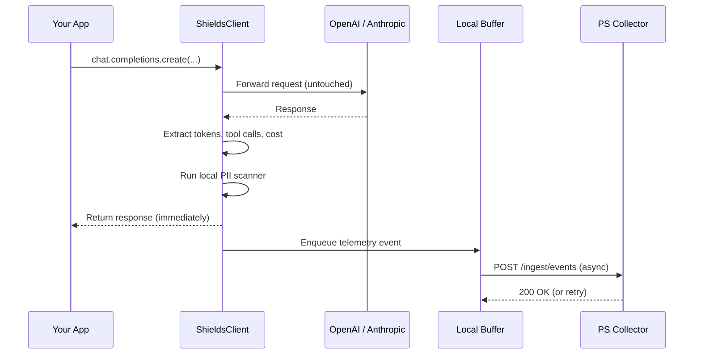

# Prompt Shields SDK — Developer Guide

A walkthrough for engineers integrating the Prompt Shields Python SDK into a real application. Covers how the SDK works under the hood, when to use each feature, and how to debug what it captures.

> If you're looking for the platform overview, see [README.md](README.md).
> If you're looking for the API reference, see [docs/sdks/python.mdx](docs/sdks/python.mdx) (rendered via Mintlify).

---

## Table of Contents

1. [Installation](#1-installation)
2. [Hello world in 60 seconds](#2-hello-world-in-60-seconds)
3. [How the SDK works](#3-how-the-sdk-works)
4. [Client configuration](#4-client-configuration)
5. [Per-request metadata](#5-per-request-metadata)
6. [Provider switching (OpenAI, Anthropic)](#6-provider-switching)
7. [Sync vs. async](#7-sync-vs-async)
8. [PII detection](#8-pii-detection)
9. [Cost estimation](#9-cost-estimation)
10. [Privacy model](#10-privacy-model)
11. [Fail-open behavior](#11-fail-open-behavior)
12. [Debugging telemetry](#12-debugging-telemetry)
13. [Production deployment patterns](#13-production-deployment-patterns)
14. [Common questions](#14-common-questions)

---

## 1. Installation

The SDK has optional dependencies. Install only the providers you need:

```bash
# OpenAI only
pip install "prompt-shields[openai]"

# Anthropic only
pip install "prompt-shields[anthropic]"

# Both
pip install "prompt-shields[all]"
```

Requires Python 3.11 or later.

Set environment variables for your secrets:

```bash
export OPENAI_API_KEY=sk-...
export PS_API_KEY=ps-...
export PS_COLLECTOR_URL=https://collector.promptshields.io   # or your self-hosted URL
```

---

## 2. Hello world in 60 seconds

```python
import os
from prompt_shields import ShieldsOpenAI

client = ShieldsOpenAI(
    api_key=os.environ["OPENAI_API_KEY"],
    ps_api_key=os.environ["PS_API_KEY"],
    ps_collector_url=os.environ["PS_COLLECTOR_URL"],
    business_unit="HR",
    use_case="interview-screening",
    owner="jane.doe@acme.com",
)

response = client.chat.completions.create(
    model="gpt-4o",
    messages=[{"role": "user", "content": "Summarize this resume in 50 words."}],
)

print(response.choices[0].message.content)
```

That's the entire integration. After this call returns:

- An `AIAsset` row is created in the Prompt Shields registry for `("openai", "gpt-4o", "interview-screening", "HR")` if it doesn't exist
- An `AIUsageEvent` row is appended with tokens, latency, cost, and any detected PII categories
- The Atlas AI dashboard shows the new asset under HR's view

---

## 3. How the SDK works



Three guarantees:

1. **Your LLM call is never blocked by telemetry.** The response is returned to your app before telemetry is sent.
2. **No prompt content leaves your host** unless you explicitly opt in with `send_prompt_text=True`. Only token counts, vendor/model, latency, tool call names, and PII category labels are transmitted by default.
3. **Telemetry delivery failures never raise.** Errors are logged at WARN level. The buffer absorbs retries; if it overflows, oldest events are dropped.

---

## 4. Client configuration

Two surfaces, identical behavior:

```python
# Typed convenience (recommended for IDE completion)
from prompt_shields import ShieldsOpenAI, ShieldsAnthropic

# Generic (useful when vendor is configured at runtime)
from prompt_shields import ShieldsClient
client = ShieldsClient(vendor="openai", api_key=..., ps_api_key=...)
```

### All constructor arguments

| Argument | Type | Required | Notes |
|----------|------|----------|-------|
| `api_key` | str | yes | Provider key. Never sent in telemetry — only a SHA-256 fingerprint. |
| `ps_api_key` | str | yes | Prompt Shields tenant key. Used to authenticate to the collector. |
| `vendor` | str | no | `"openai"` (default) or `"anthropic"`. Set by `ShieldsOpenAI` / `ShieldsAnthropic`. |
| `ps_collector_url` | str | no | Defaults to `http://localhost:8000`. Set to your production collector URL. |
| `business_unit` | str | no | Org unit using the AI. Becomes part of the asset merge key. |
| `use_case` | str | no | Business name for this AI use case. Maps to `use_case_name` in the registry. |
| `owner` | str | no | Email of responsible person. Maps to `owner_email`. |
| `data_classification` | str | no | One of `public`, `internal`, `confidential`, `restricted`. Highest classification wins on dedup. |
| `environment` | str | no | `production`, `staging`, `dev`. Separate envs are separate assets. |
| `calling_service` | str | no | Service/app name for dedup fallback when use_case isn't set. |
| `scan_pii` | bool | no | Default `True`. Set `False` to disable local PII detection. |
| `send_prompt_text` | bool | no | Default `False`. Set `True` to log full prompt content (requires explicit security review). |
| `pricing_table` | dict | no | Override default token-to-USD pricing. See [Cost estimation](#9-cost-estimation). |

### Why metadata at the client level?

The constructor metadata is **immutable per client instance** and stamps every event. Use one client per (business_unit, use_case, environment) tuple — for example, one client in your HR screening service, a different one in the legal contract-review service. This is how the registry groups assets correctly.

```python
# DON'T — single global client with mixed use cases
client = ShieldsOpenAI(api_key=..., ps_api_key=...)  # no metadata, no governance value

# DO — one client per logical use case
hr_client = ShieldsOpenAI(
    api_key=..., ps_api_key=...,
    business_unit="HR", use_case="interview-screening",
    owner="jane@acme.com", environment="production",
)

legal_client = ShieldsOpenAI(
    api_key=..., ps_api_key=...,
    business_unit="Legal", use_case="contract-review",
    owner="bob@acme.com", environment="production",
)
```

---

## 5. Per-request metadata

For data that varies per call (session ID, data sources, output destination), use `ps_metadata`:

```python
response = client.chat.completions.create(
    model="gpt-4o",
    messages=[{"role": "user", "content": "Review this candidate file..."}],
    ps_metadata={
        "data_sources": ["candidates_db", "linkedin_api"],
        "output_destination": "hiring_dashboard",
        "risk_tags": ["pii", "gdpr"],
        "session_id": "review-2025-04-12-001",
        "user_id": "hr_user_42",
    },
)
```

| Field | Purpose |
|-------|---------|
| `data_sources` | Systems feeding data into this prompt — populates data flow lineage |
| `output_destination` | Where the AI output goes — completes the lineage graph |
| `risk_tags` | Free-form tags for risk filtering (e.g., `gdpr`, `hipaa`, `pii`) |
| `session_id` | Groups related calls in a multi-turn conversation |
| `user_id` | Opaque identifier — hash before passing if you need to anonymize |

All five are optional. Omit what you don't have.

---

## 6. Provider switching

The SDK uses the same `chat.completions.create(...)` surface for every vendor, so swapping providers is a one-line change.

### OpenAI

```python
from prompt_shields import ShieldsOpenAI

client = ShieldsOpenAI(api_key="sk-...", ps_api_key="ps-...")
response = client.chat.completions.create(
    model="gpt-4o",
    messages=[{"role": "user", "content": "..."}],
)
```

### Anthropic

```python
from prompt_shields import ShieldsAnthropic

client = ShieldsAnthropic(api_key="sk-ant-...", ps_api_key="ps-...")
response = client.chat.completions.create(
    model="claude-sonnet-4-20250514",
    messages=[{"role": "user", "content": "..."}],
    max_tokens=1024,  # Anthropic requires this; SDK defaults to 1024 if omitted
)
```

Behind the scenes, `ShieldsAnthropic.chat.completions.create(...)` calls `anthropic.Anthropic.messages.create(...)`. The cross-vendor surface is consistent so your app code doesn't change when you switch.

### Tool / function calls

Both vendors' tool-use shapes are parsed automatically. The registry records which tools were called (names only, not arguments):

```python
# OpenAI — function calling
response = client.chat.completions.create(
    model="gpt-4o",
    messages=[{"role": "user", "content": "What's the weather in Paris?"}],
    tools=[{
        "type": "function",
        "function": {
            "name": "get_weather",
            "parameters": {"type": "object", "properties": {"city": {"type": "string"}}},
        },
    }],
)
# Telemetry will include: tool_calls_used = [{"name": "get_weather", "type": "function"}]
```

```python
# Anthropic — tool use
response = client.chat.completions.create(
    model="claude-sonnet-4-20250514",
    messages=[{"role": "user", "content": "Search the company directory for Jane Doe."}],
    tools=[{
        "name": "search_directory",
        "description": "Search the company directory",
        "input_schema": {"type": "object", "properties": {"name": {"type": "string"}}},
    }],
)
# Telemetry will include: tool_calls_used = [{"name": "search_directory", "type": "tool_use"}]
```

---

## 7. Sync vs. async

Use the async clients if your app already runs in an event loop (FastAPI, asyncio agents). They avoid the threaded fast-path the sync client uses for telemetry flush.

```python
from prompt_shields import AsyncShieldsOpenAI

async def review_candidate(resume_text: str):
    client = AsyncShieldsOpenAI(
        api_key="sk-...",
        ps_api_key="ps-...",
        business_unit="HR",
        use_case="interview-screening",
    )
    response = await client.chat.completions.create(
        model="gpt-4o",
        messages=[{"role": "user", "content": resume_text}],
    )
    return response.choices[0].message.content
```

### FastAPI example

```python
from fastapi import FastAPI
from prompt_shields import AsyncShieldsOpenAI

app = FastAPI()

# Build once at startup
ai_client = AsyncShieldsOpenAI(
    api_key=os.environ["OPENAI_API_KEY"],
    ps_api_key=os.environ["PS_API_KEY"],
    business_unit="HR",
    use_case="interview-screening",
    owner="jane@acme.com",
    environment="production",
)

@app.post("/review")
async def review(resume: str, session_id: str):
    response = await ai_client.chat.completions.create(
        model="gpt-4o",
        messages=[{"role": "user", "content": resume}],
        ps_metadata={"session_id": session_id, "data_sources": ["resumes_bucket"]},
    )
    return {"summary": response.choices[0].message.content}

@app.on_event("shutdown")
async def shutdown():
    await ai_client.aclose()  # drains the telemetry buffer
```

### When in doubt, use sync

The sync client works fine inside async code — it spawns a daemon thread for the telemetry flush. The async client just avoids the thread overhead, which matters at high RPS. For typical request rates (< 100 RPS), either works.

---

## 8. PII detection

The SDK runs a **local pattern-based PII scanner** on every prompt before sending telemetry. Categories detected are sent as labels — actual content stays on your host.

### Detected categories

| Category | Patterns / Keywords |
|----------|---------------------|
| `email` | Regex match on email-like strings |
| `phone` | International + US phone formats |
| `ssn` | US SSN `123-45-6789` |
| `credit_card` | 13-19 digits with optional separators |
| `ip_address` | IPv4 dotted-quad |
| `iban` | IBAN format |
| `health_data` | Keywords: `diagnosis`, `prescription`, `medication`, `patient id`, `icd-10`, etc. |
| `financial_data` | Keywords: `account number`, `routing number`, `swift code`, `tax id`, etc. |

### Example output

```python
client = ShieldsOpenAI(api_key="sk-...", ps_api_key="ps-...")
client.chat.completions.create(
    model="gpt-4o",
    messages=[{"role": "user", "content": "Email jane@acme.com about SSN 123-45-6789"}],
)

# Telemetry sent to collector:
# {
#   "vendor": "openai",
#   "model": "gpt-4o",
#   "tokens_in": ..., "tokens_out": ...,
#   "detected_pii_types": ["email", "ssn"],  ← only categories, not content
#   ...
# }
```

### Disabling PII detection

```python
client = ShieldsOpenAI(api_key="sk-...", ps_api_key="ps-...", scan_pii=False)
```

### Calling the scanner directly

You can use the scanner outside the SDK — useful for pre-filtering prompts before sending to AI:

```python
from prompt_shields import detect_pii_categories, scan_messages

detect_pii_categories("Email jane@acme.com")
# → ['email']

scan_messages([
    {"role": "system", "content": "You are helpful."},
    {"role": "user", "content": "My phone is 415-555-0199"},
])
# → ['phone']
```

---

## 9. Cost estimation

The SDK estimates USD cost per call using a built-in pricing table covering common models from OpenAI, Anthropic, and Google.

```python
from prompt_shields import estimate_cost

estimate_cost("openai", "gpt-4o", tokens_in=1000, tokens_out=2000)
# → 0.0225 (USD)

estimate_cost("anthropic", "claude-sonnet-4-20250514", tokens_in=1000, tokens_out=1000)
# → 0.018
```

Returns `None` when the model is unknown — the collector treats this as "unmetered" rather than zero.

### Custom pricing

If you have negotiated rates or are using an internal LLM gateway, override the default table:

```python
custom_pricing = {
    ("openai", "gpt-4o"): (0.0020, 0.0080),  # negotiated rate
    ("custom", "internal-llm-v1"): (0.0001, 0.0002),  # your hosted model
}

client = ShieldsOpenAI(
    api_key="sk-...",
    ps_api_key="ps-...",
    pricing_table=custom_pricing,
)
```

Format: `{(vendor, model): (input_per_1k_tokens, output_per_1k_tokens)}`.

---

## 10. Privacy model

### What's sent by default

| Field | Sent? | Notes |
|-------|-------|-------|
| Vendor name (e.g. `openai`) | Yes | |
| Model name (e.g. `gpt-4o`) | Yes | |
| Token counts | Yes | From provider response |
| Latency (ms) | Yes | Measured at SDK boundary |
| Tool call names | Yes | Names only, not arguments |
| PII category labels | Yes | Only category names, never content |
| Cost (USD) | Yes | Calculated locally |
| API key fingerprint | Yes | SHA-256 truncated to 16 hex chars |
| Business metadata | Yes | Only what you pass in constructor / `ps_metadata` |
| **Prompt content** | **No** | Unless `send_prompt_text=True` |
| **Response content** | **No** | Never, regardless of settings |
| **Raw API key** | **No** | Only the fingerprint |
| **Tool call arguments** | **No** | Only the tool name |

### When to enable `send_prompt_text=True`

For governance use cases that require prompt review — for example, you want to detect prompt template drift, audit policy violations, or build a prompt library. **Get security sign-off first** and apply at the tenant level:

```python
client = ShieldsOpenAI(
    api_key="sk-...",
    ps_api_key="ps-...",
    send_prompt_text=True,  # explicit opt-in
)
```

Even with `send_prompt_text=True`, the collector's tenant-level `content_logging_enabled` setting must also be on. Defense in depth.

### API key fingerprinting

Every event includes a SHA-256 fingerprint of the LLM provider API key (truncated to 16 hex chars). The raw key is never transmitted. The fingerprint lets the registry group calls by issuer — useful for detecting unexpected API key usage — without authentication risk.

```python
import hashlib
hashlib.sha256(b"sk-very-secret-key").hexdigest()[:16]
# → e.g. "a3f5c1e8d29b7406"
```

---

## 11. Fail-open behavior

The SDK is designed to never block your LLM calls due to telemetry issues.

### Local buffer

- Holds up to **1000 events** in memory (configurable via `MAX_BUFFER_SIZE`)
- On collector failure, events are re-enqueued for retry
- On buffer overflow, the **oldest** event is dropped (a `WARNING` log is emitted)

### Error swallowing

All telemetry errors are caught and logged at `WARNING` level. Examples:

```
WARNING:prompt_shields.telemetry:Telemetry send failed: 503
WARNING:prompt_shields.telemetry:Telemetry send error: ConnectError(...)
WARNING:prompt_shields.telemetry:Telemetry buffer full, dropping oldest event
```

### What this means in practice

```python
# Even if the collector is completely down...
client = ShieldsOpenAI(
    api_key="sk-...",
    ps_api_key="ps-...",
    ps_collector_url="http://does-not-exist.local:8000",
)

# ...this call still succeeds and returns the OpenAI response
response = client.chat.completions.create(
    model="gpt-4o",
    messages=[{"role": "user", "content": "hi"}],
)
# Latency: equal to OpenAI's latency + 5s (telemetry timeout) at worst
```

The 5-second telemetry timeout is the only added latency in the worst case. Successful telemetry sends add < 100ms typically.

---

## 12. Debugging telemetry

### See what's being sent

Enable DEBUG logging on the `prompt_shields.telemetry` logger:

```python
import logging
logging.basicConfig(level=logging.DEBUG)
logging.getLogger("prompt_shields.telemetry").setLevel(logging.DEBUG)
```

### Verify the event payload

Call `_build_event` directly to inspect what would be sent without making an LLM call:

```python
from unittest.mock import MagicMock
from prompt_shields import ShieldsOpenAI

client = ShieldsOpenAI(
    api_key="sk-test",
    ps_api_key="ps-test",
    business_unit="HR",
    use_case="screening",
)

mock_response = MagicMock()
mock_response.usage.prompt_tokens = 100
mock_response.usage.completion_tokens = 200
mock_response.choices = []

event = client._build_event(
    model="gpt-4o",
    messages=[{"role": "user", "content": "Email jane@acme.com"}],
    response=mock_response,
    latency_ms=150,
    ps_metadata={"session_id": "test-001"},
)
print(event)
```

Output:
```python
{
    'vendor': 'openai',
    'model': 'gpt-4o',
    'source': 'sdk',
    'tokens_in': 100,
    'tokens_out': 200,
    'latency_ms': 150,
    'tool_calls_used': None,
    'cost': 0.00225,
    'api_key_fingerprint': 'fa6c9b7d2a1e8403',
    'business_unit': 'HR',
    'use_case_name': 'screening',
    'session_id': 'test-001',
    'detected_pii_types': ['email'],
}
```

### Check the collector received it

If you're self-hosting the collector, query the registry API:

```bash
curl -H "Authorization: Bearer ps-test" \
  http://localhost:8000/api/v1/registry/assets?business_unit=HR
```

---

## 13. Production deployment patterns

### Pattern 1: One client per service

Best for service-per-use-case architectures. Each microservice owns one client with metadata baked in.

```python
# In hr_screening_service/main.py
ai = ShieldsOpenAI(
    api_key=os.environ["OPENAI_API_KEY"],
    ps_api_key=os.environ["PS_API_KEY"],
    business_unit="HR",
    use_case="interview-screening",
    owner=os.environ["SERVICE_OWNER"],
    environment=os.environ["DEPLOY_ENV"],
    calling_service="hr-screening-service",
)
```

### Pattern 2: Client factory for multi-tenant apps

When one service serves multiple tenants or use cases, build clients on demand:

```python
from functools import lru_cache
from prompt_shields import ShieldsOpenAI

@lru_cache(maxsize=64)
def get_client(business_unit: str, use_case: str) -> ShieldsOpenAI:
    return ShieldsOpenAI(
        api_key=os.environ["OPENAI_API_KEY"],
        ps_api_key=os.environ["PS_API_KEY"],
        business_unit=business_unit,
        use_case=use_case,
        environment=os.environ["DEPLOY_ENV"],
    )

# Usage
client = get_client("HR", "interview-screening")
response = client.chat.completions.create(...)
```

`lru_cache` is fine here — each client holds a small connection pool. 64 cached clients is < 5MB.

### Pattern 3: Centralized via gateway

If you don't want to instrument every service, run the **gateway proxy** instead:

```bash
docker run -p 8080:8080 \
  -e PS_COLLECTOR_URL=https://collector.promptshields.io \
  -e PS_API_KEY=ps-... \
  promptshields/gateway

# In every service
export OPENAI_BASE_URL=http://gateway:8080/v1
```

No SDK changes. Services pass annotations via HTTP headers:

```python
# Standard openai client, no PS SDK
from openai import OpenAI
client = OpenAI()  # picks up OPENAI_BASE_URL automatically

response = client.chat.completions.create(
    model="gpt-4o",
    messages=[...],
    extra_headers={
        "X-PS-Business-Unit": "HR",
        "X-PS-Use-Case": "interview-screening",
        "X-PS-Owner": "jane@acme.com",
    },
)
```

The trade-off: gateway mode gives less control over event shape (no `ps_metadata`, no Python-level PII scanning), but requires zero code changes.

---

## 14. Common questions

### Q: Does this slow down my LLM calls?

Typical overhead: **< 5ms**. The SDK runs the PII scanner locally (regex matching, microseconds) and enqueues telemetry to an in-memory buffer. The collector POST happens after your call returns.

Worst case (collector unreachable): **+ 5 seconds** for the telemetry timeout. Your LLM response is already in your hands by then.

### Q: What if the OpenAI / Anthropic SDK gets a new version?

The Prompt Shields SDK only wraps the public `client.chat.completions.create()` / `client.messages.create()` methods. As long as those signatures stay backwards-compatible (which both vendors maintain), the wrapper works.

If a vendor releases a new method (e.g., `client.responses.create()`), we add an adapter — it doesn't break existing code.

### Q: How do I get telemetry from streaming responses?

Streaming support is **deferred to Phase 2**. Currently if you pass `stream=True`, the response is returned correctly but telemetry is skipped (no usage data is available until the stream completes).

Workaround: collect tokens manually and call `client._telemetry.enqueue(...)` after the stream finishes. Or use the gateway proxy, which has full streaming support.

### Q: How do I run a local collector for development?

```bash
git clone https://github.com/jun-bit-pulse-ai/prompt-shields-sdk
cd prompt-shields-sdk
docker compose up -d
# Run migrations
PYTHONPATH=packages alembic -c packages/db/alembic.ini upgrade head
# Seed demo tenant
PYTHONPATH=packages python3 demo/seed_data.py
```

Then point your SDK at `http://localhost:8000` with `ps_api_key="ps-demo-key-acme"`.

### Q: How do I onboard a new team / business unit?

You don't — discovery is automatic. The first call from a new `business_unit` value creates a new asset. Owners get auto-assigned from the `owner` field. See it appear in Atlas AI within seconds.

### Q: My LLM provider isn't in the pricing table. What happens?

`cost` is `None` in the telemetry. The registry shows the asset but cost summaries skip it. Add a `pricing_table=` override to fix.

### Q: How do I rotate `ps_api_key` without downtime?

Generate a new key in the Atlas AI dashboard, deploy with the new key, then revoke the old one. Both keys work during the transition window (each call authenticates independently).

### Q: Can I use this without sending any telemetry — just for local development?

Yes — point at a non-existent collector URL. The SDK fails open, your LLM calls succeed, only WARN logs appear:

```python
client = ShieldsOpenAI(
    api_key="sk-...",
    ps_api_key="ps-dev",
    ps_collector_url="http://localhost:0",  # nothing listening
    scan_pii=False,  # skip the local scan if you don't want it
)
```

---

## Further reading

- [README.md](README.md) — platform overview, components, gateway, collector
- [CHANGELOG.md](CHANGELOG.md) — version history and feature additions
- [docs/sdks/python.mdx](docs/sdks/python.mdx) — Mintlify-rendered SDK reference
- [docs/integrations/ardoq.mdx](docs/integrations/ardoq.mdx) — Ardoq Integration Builder setup
- [`packages/sdk/prompt_shields/`](packages/sdk/prompt_shields/) — SDK source code

Questions? Open an issue at [github.com/jun-bit-pulse-ai/prompt-shields-sdk/issues](https://github.com/jun-bit-pulse-ai/prompt-shields-sdk/issues).
