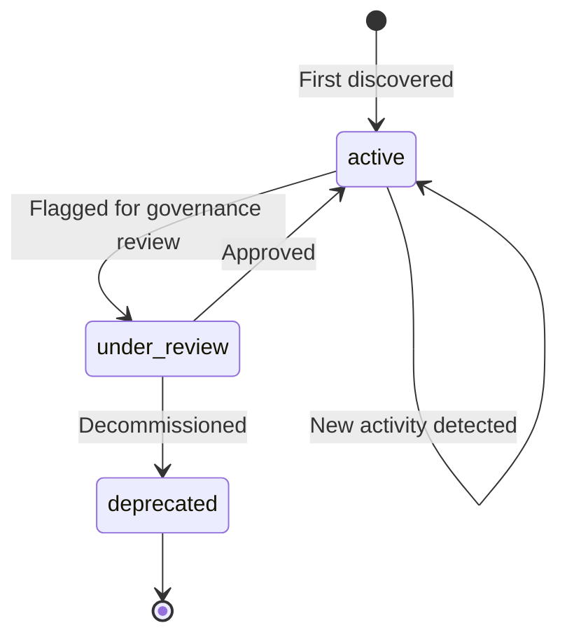

# AI Asset Registry

The AI Asset Registry is the central data store for all discovered AI usage across your organization. Every AI use case — whether found by a browser extension, SDK, gateway, or platform signal — becomes an **AI Asset** in the registry.

## What is an AI Asset?

An AI Asset represents a **specific AI use case** within a business unit. It's the combination of:

- **Who** is using AI (business unit + owner)
- **What** AI they're using (vendor + model)
- **Why** they're using it (use case name)
- **Where** it runs (environment)

**Example:** "HR department using OpenAI GPT-4o for interview screening in production" is one AI Asset.

## Asset Granularity

One row per unique combination of `(vendor, model, use_case_name, business_unit, environment)` within a tenant.

This means:
- HR using GPT-4o for screening = **Asset A**
- Legal using GPT-4o for contracts = **Asset B** (different use case + BU)
- HR using GPT-4o for screening in staging = **Asset C** (different environment)

## Asset Lifecycle

## Key Fields

| Field | Description | Example |
|-------|-------------|---------|
| `vendor` | AI provider | `openai`, `anthropic`, `google` |
| `model` | Specific model | `gpt-4o`, `claude-sonnet-4-20250514` |
| `use_case_name` | Business purpose | `interview-screening` |
| `business_unit` | Org unit | `HR`, `Legal`, `Engineering` |
| `owner_email` | Responsible person | `jane.doe@acme.com` |
| `data_classification` | Data sensitivity | `confidential` |
| `discovery_source` | How it was found | `["sdk", "browser_extension"]` |
| `confidence` | Discovery certainty | `verified` |
