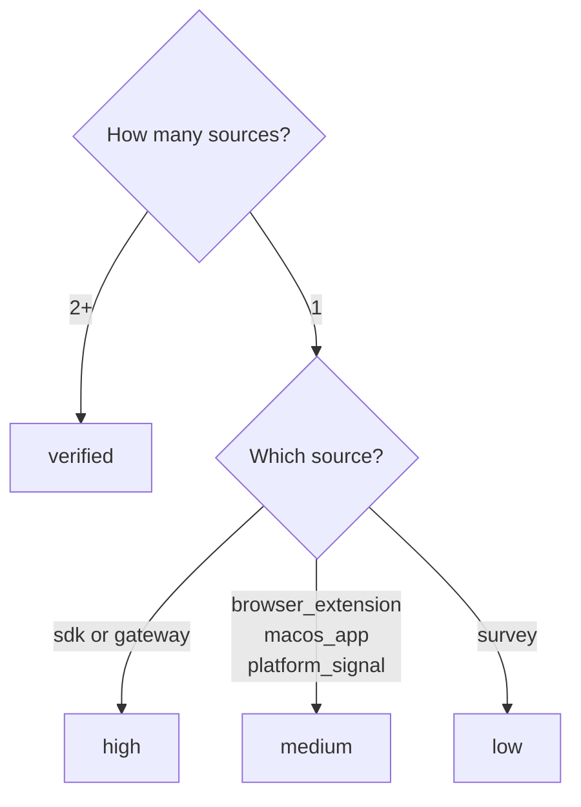

# Confidence Scoring

Every AI asset has a `confidence` field that indicates how certain Prompt Shields is that the asset exists and is accurately described. Confidence is **automatically computed** based on the number and type of discovery sources.

## Confidence Levels

| Level | Criteria | Meaning |
|-------|----------|---------|
| `low` | Single survey response only | Self-reported, no technical verification |
| `medium` | Single detection from browser extension or platform signal | Observed once via automated detection |
| `high` | Single detection from SDK or gateway | Verified via code-level instrumentation |
| `verified` | Multiple independent sources corroborate | Highest certainty — detected by 2+ channels |

## How It's Computed



## Why Multi-Source Matters

A single survey response ("yes, my team uses ChatGPT") provides weak evidence. But when a browser extension also detects ChatGPT usage AND the gateway logs API calls from the same team — that's three independent signals confirming the same asset.

**Example progression:**
1. Survey reports "HR uses ChatGPT" → confidence: `low`
2. Browser extension detects ChatGPT in HR → confidence: `medium` (now 2 sources → `verified`)
3. SDK captures GPT-4o API calls tagged `business_unit=HR` → confidence: `verified` (3 sources)

## Filtering by Confidence

Use the `confidence` query parameter to filter assets:

```bash
# Only show verified assets (highest certainty)
GET /partner/v1/assets?confidence=verified

# Show high and verified (exclude unconfirmed)
GET /partner/v1/assets?confidence=high
```

<Info>
  The `confidence` filter returns assets **at or above** the specified level.
  `confidence=medium` returns medium, high, and verified assets.
</Info>
