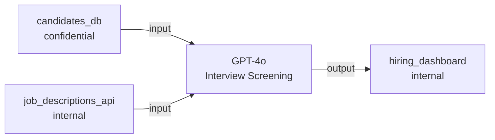

# Data Flows

Data flows track **where data comes from** and **where AI outputs go** for each asset. This is critical for data governance, GDPR compliance, and understanding AI risk exposure.

## Data Flow Structure

Each flow has:
- **Source system** — where input data originates
- **Destination system** — where outputs are sent
- **Direction** — `input` (data flowing into AI) or `output` (AI results flowing out)
- **Data classification** — sensitivity level of data in this flow
- **Detected PII types** — automatically detected personal data categories

## Example

For an "interview screening" AI asset:



API response:
```json
{
  "data": [
    {
      "source_system": "candidates_db",
      "destination_system": "hiring_dashboard",
      "direction": "input",
      "data_classification": "confidential",
      "detected_pii_types": ["name", "email", "phone", "address"]
    },
    {
      "source_system": "job_descriptions_api",
      "destination_system": "hiring_dashboard",
      "direction": "input",
      "data_classification": "internal",
      "detected_pii_types": null
    }
  ]
}
```

## How PII Detection Works

The SDK and gateway run a lightweight classifier on prompt input text to detect PII categories:

| PII Type | Detection Method |
|----------|-----------------|
| `email` | Regex pattern matching |
| `phone` | Regex pattern matching |
| `name` | Named entity recognition |
| `ssn` | Regex pattern matching |
| `address` | Named entity recognition |
| `financial_data` | Keyword + pattern matching |
| `health_data` | Keyword matching |

<Warning>
  PII detection is best-effort. It identifies common patterns but may miss
  obfuscated or domain-specific sensitive data. Use it as a signal, not a
  guarantee.
</Warning>
