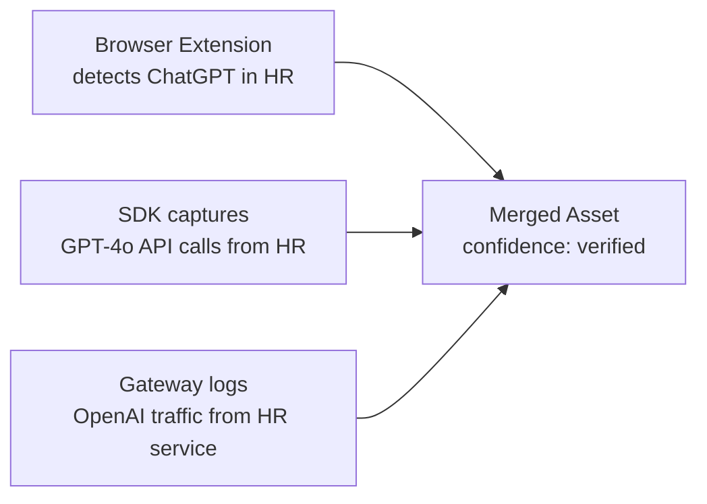

# Discovery Sources

Prompt Shields uses multiple independent channels to discover AI usage. When the same AI system is detected by multiple sources, confidence increases.

## Discovery Channels

| Source | What It Catches | How It Works |
|--------|----------------|--------------|
| **Browser Extension** | Shadow AI (ChatGPT, Gemini, Copilot in browser) | Chrome, Safari, Edge extensions monitor AI tool usage |
| **macOS App** | System-level AI tool usage | Accessibility-based tracking across all applications |
| **SDK** | Developer API calls with rich business context | Drop-in OpenAI wrapper captures metadata |
| **Gateway** | All LLM API traffic (zero code change) | Proxy intercepts and logs requests |
| **Platform Signal** | Enterprise platform audit logs | Pulls from Microsoft Purview, Defender, Azure |
| **Survey** | Self-reported AI usage | Human Input Agent conducts interviews |

## Coverage Matrix

```
                     Browser  macOS   SDK    Gateway  Platform
Shadow AI              Yes     Yes     -       -        -
Developer API calls     -       -     Yes     Yes       -
CI/CD pipeline AI       -       -     Yes     Yes       -
Backend AI services     -       -     Yes     Yes       -
AI in internal tools   Yes     Yes     -      Yes       -
Platform audit logs     -       -      -       -       Yes
```

## Multi-Source Corroboration

When the same AI capability is detected by multiple sources, the system merges them into a single asset with multiple evidence trails:



The `discovery_source` field is an array showing all channels that detected this asset.
