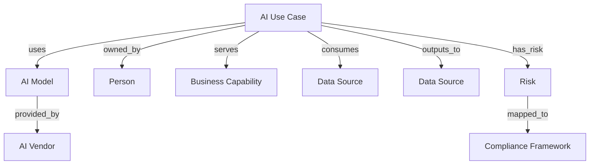

# Ardoq Integration

Connect Prompt Shields to Ardoq's AI Lens to automatically populate your AI asset inventory with discovered AI systems, data flows, and risk mappings.

## Prerequisites

- Ardoq account with Integration Builder access
- Prompt Shields partner credentials ([get them here](https://app.promptshields.io/partners))
- Ardoq AI Lens metamodel configured

## Setup Steps

<Steps>
  <Step title="Get Partner Credentials">
    From the Atlas AI Dashboard, go to **Partners > Add Integration > Ardoq**.
    Copy your `client_id`, `client_secret`, and `api_key`.
  </Step>

  <Step title="Create Integration Builder Variables">
    In Ardoq, go to **Integration Builder > Variables** and add:

    | Variable | Value |
    |----------|-------|
    | `PS_BASE_URL` | `https://api.promptshields.io` |
    | `PS_CLIENT_ID` | Your `client_id` |
    | `PS_CLIENT_SECRET` | Your `client_secret` (mark as secret) |
    | `PS_API_KEY` | Your fallback API key (mark as secret) |
  </Step>

  <Step title="Import the Integration Recipe">
    Import the following JSON recipe into Ardoq Integration Builder:

    ```json
    {
      "name": "Prompt Shields AI Asset Registry",
      "source": {
        "type": "rest",
        "url": "{{PS_BASE_URL}}/partner/v1/assets?limit=200",
        "method": "GET",
        "headers": {
          "Authorization": "Bearer {{PS_API_KEY}}"
        },
        "pagination": {
          "type": "cursor",
          "cursor_path": "meta.next_cursor",
          "cursor_param": "after"
        },
        "data_path": "data"
      },
      "schedule": "every 4 hours"
    }
    ```

    <Info>
      This recipe uses the API key fallback since Ardoq Integration Builder
      has limited OAuth 2.0 Client Credentials support. The API key provides
      the same read-only access.
    </Info>
  </Step>

  <Step title="Configure Field Mapping">
    Map Prompt Shields fields to Ardoq component fields:

    | PS Field | Ardoq Field | Component Type |
    |----------|-------------|----------------|
    | `use_case_name` + `vendor`/`model` | Name | AI Use Case |
    | `vendor` | Name | AI Vendor |
    | `model` | Name | AI Model |
    | `business_unit` | Name | Business Capability |
    | `owner_email` | Email | Person |
    | `status` | Lifecycle Status | AI Use Case |
    | `data_classification` | Data Classification | AI Use Case |
    | `confidence` | Discovery Confidence | AI Use Case |
    | `discovery_source` | Discovery Sources | AI Use Case |
  </Step>

  <Step title="Configure Reference Mapping">
    Set up relationships between components:

    ```
    AI Use Case ──uses──▶ AI Model
    AI Model ──provided_by──▶ AI Vendor
    AI Use Case ──owned_by──▶ Person
    AI Use Case ──serves──▶ Business Capability
    ```
  </Step>

  <Step title="Run Initial Sync">
    Click **Run Now** in Integration Builder. Verify that AI assets appear
    in your Ardoq workspace as AI Use Case components with correct relationships.
  </Step>

  <Step title="Enable Scheduled Sync">
    Enable the 4-hour schedule. After the initial full sync, switch the URL to
    use the delta feed for efficiency:

    ```
    {{PS_BASE_URL}}/partner/v1/changes?since={{LAST_SYNC_TOKEN}}&limit=200
    ```
  </Step>
</Steps>

## Ardoq Metamodel Mapping



## What CISOs See in Ardoq

After integration, CISOs and EAs can:

- **Browse** the AI landscape across all business units
- **Filter** by vendor, model, risk level, or data classification
- **Trace** from a business capability down to which AI models and data sources are involved
- **Identify** high-risk AI assets handling restricted data
- **Track** discovery confidence to prioritize governance reviews
- **Monitor** new AI asset creation via the Ardoq activity feed

## Troubleshooting

<AccordionGroup>
  <Accordion title="No assets appear after sync">
    1. Verify your API key is correct in Integration Builder variables
    2. Check that `data_path` is set to `data` (not `data.assets`)
    3. Confirm your Prompt Shields tenant has discovered assets (check Atlas AI Dashboard)
  </Accordion>
  <Accordion title="Duplicate components in Ardoq">
    Ensure your Integration Builder uses `id` as the unique key for component matching. PS asset IDs are stable UUIDs that don't change across syncs.
  </Accordion>
  <Accordion title="Missing relationships">
    Relationships require both source and target components to exist. Run the sync twice — first to create all components, second to resolve references.
  </Accordion>
</AccordionGroup>
