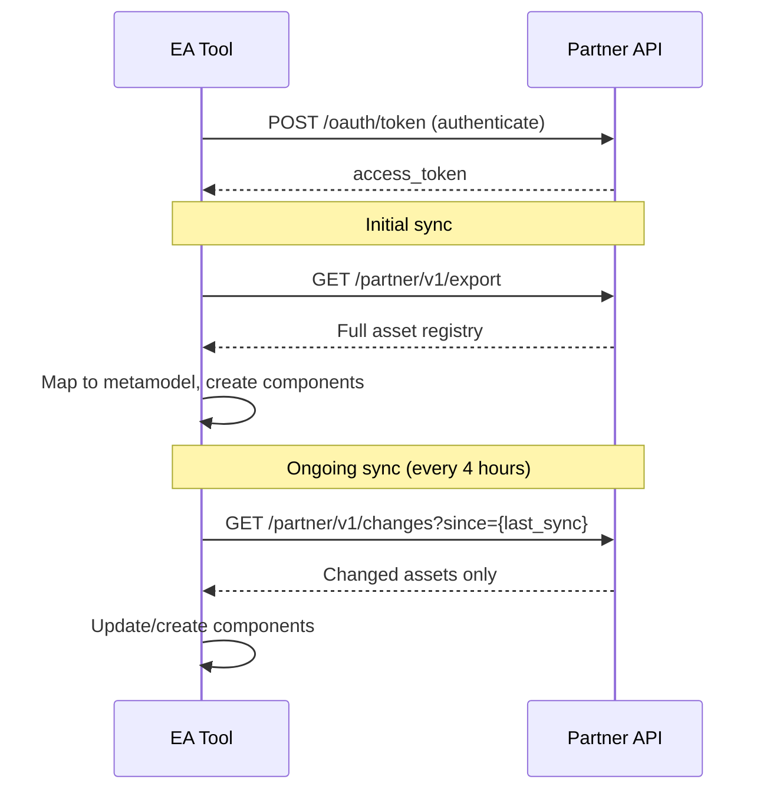

# Integrations

Prompt Shields feeds AI asset data into your existing EA platform. The Partner API provides the data; your EA tool provides the visualization and governance layer.

## Supported Platforms

<CardGroup cols={3}>
  <Card title="Ardoq" icon="diagram-project" href="/integrations/ardoq">
    Integration Builder recipe for AI Lens
  </Card>
  <Card title="LeanIX" icon="layer-group" href="/integrations/leanix">
    REST API integration via Integration Hub
  </Card>
  <Card title="ServiceNow" icon="server" href="/integrations/servicenow">
    CMDB integration via IntegrationHub
  </Card>
</CardGroup>

## Integration Pattern

All EA integrations follow the same pattern:

## Data Mapping

Prompt Shields data maps to EA tool concepts:

| PS Data | EA Concept | Ardoq | LeanIX | ServiceNow |
|---------|-----------|-------|--------|------------|
| AI Asset | Application/Capability | Component (AI Use Case) | IT Component | CI (AI Application) |
| Vendor | Provider | Component (AI Vendor) | Provider | Vendor |
| Business Unit | Organization | Component (Business Capability) | Organization | Business Unit |
| Data Flow | Data Flow | Reference | Data Flow | Relationship |
| Risk | Risk | Component (Risk) | Risk | Risk |
| Owner | Person | Component (Person) | User | User |

## Custom Integrations

For EA tools not listed above, use the Partner API directly:

1. Authenticate via OAuth or API key
2. Fetch assets with `GET /partner/v1/assets`
3. Map fields to your metamodel
4. Use `GET /partner/v1/changes` for ongoing sync
