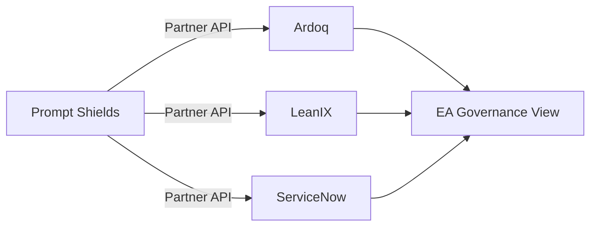

# Prompt Shields Partner API

Prompt Shields discovers AI usage across your entire organization — from developers calling LLM APIs in code, to employees using ChatGPT in the browser, to AI embedded in enterprise tools. The Partner API gives EA platforms structured access to this discovery data.

## What Prompt Shields Discovers

<CardGroup cols={2}>
  <Card title="Shadow AI" icon="ghost">
    Browser extensions detect ChatGPT, Gemini, Copilot usage across Chrome, Safari, and Edge
  </Card>
  <Card title="Developer AI" icon="code">
    SDK and gateway proxy capture every LLM API call from your codebase
  </Card>
  <Card title="Data Flows" icon="diagram-project">
    Track which systems feed data into AI and where outputs go
  </Card>
  <Card title="Risk Mapping" icon="shield-halved">
    Map each AI asset to NIST AI RMF, ISO 42001, and EU AI Act frameworks
  </Card>
</CardGroup>

## How Partners Use This API

The Partner API is designed for **Enterprise Architecture tools** that need to incorporate AI asset data into their governance platforms.

**Typical integration flow:**

1. Your EA tool authenticates via OAuth 2.0 or API key
2. Initial sync via `GET /partner/v1/export`
3. Ongoing delta sync via `GET /partner/v1/changes?since={last_sync}`
4. Map AI assets to your metamodel (components, relationships, capabilities)

## Key Concepts

| Concept | Description |
|---------|-------------|
| **AI Asset** | A discovered AI use case (e.g., "HR using GPT-4o for interview screening") |
| **Discovery Source** | How the asset was found (SDK, gateway, browser extension, platform signal) |
| **Confidence** | How certain we are the asset exists (low to verified, based on corroborating sources) |
| **Data Flow** | Input/output data lineage for an AI asset |
| **Risk Mapping** | Risk assessment linked to a governance framework |

<Card title="Ready to integrate?" icon="rocket" href="/quickstart">
  Follow the quickstart guide to get your first API call working in 5 minutes
</Card>
